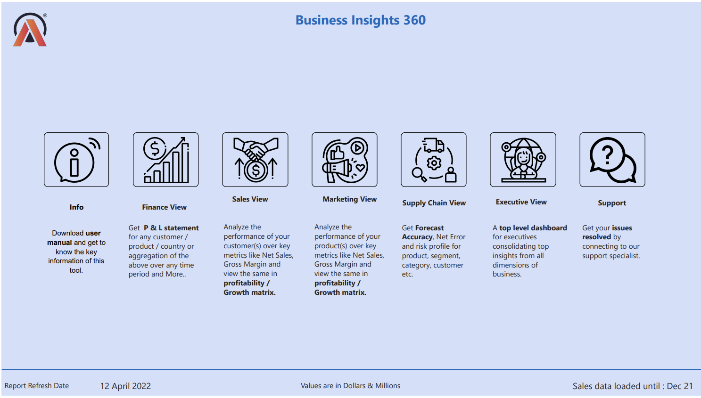

# Business Insights 360 – Power BI Dashboard
An academic Project
A full-scale Power BI solution designed for AtliQ Hardware (fictional company), providing unified business insights across Finance, Sales, Marketing, Supply Chain, and Executive views. 

---

## 📌 Objective

Enable data-driven decision-making by replacing fragmented Excel-based reporting with interactive, real-time dashboards. Key goals:

- Consolidate SQL and Excel data sources
- Build an optimized Power BI data model
- Visualize KPIs with drill-through, slicers, and dynamic navigation
- Support executive decisions with high-level summaries

---

## 🧰 Tools Used

| Tool        | Purpose                           |
|-------------|-----------------------------------|
| **Power BI**    | Data modeling, visuals, DAX measures |
| **SQL (MySQL)** | Data extraction and transformation |
| **Excel/CSV**   | Raw sales and marketing data       |
| **DAX Studio**  | DAX performance tuning              |

---

## 📊 Dashboard Views

| View           | Description |
|----------------|-------------|
| **Finance**    | Net Sales, Gross Margin, Net Profit, YoY changes |
| **Sales**      | Product/customer performance, regional insights |
| **Marketing**  | Impact of ads & discounts on revenue/profitability |
| **Supply Chain** | Forecast accuracy, net error, inventory health |
| **Executive**  | High-level KPIs, market share, strategic view |

---

## 🧠 Key Features

- 💡 **Field Parameters** to switch between metrics like Net Sales, Gross Margin
- 🧭 **Drill-through navigation** between views
- 🎯 **Dynamic KPIs** with conditional formatting
- 📌 **Slicers & filters** for regional and channel analysis
- ⚙️ **Performance optimization** using best practices in DAX

---

## 💼 Business Impact

This dashboard enabled AtliQ Hardware to:

- Improve net sales by **182.37%** compared to benchmark
- Achieve **72.99%** forecast accuracy
- Maintain **48.90%** Gross Margin across top products
- Identify key markets and customers for strategic focus
- Replace Excel-based workflows with interactive dashboards

---

## 📈 Learnings

- Connected MySQL and Excel in Power BI
- Used Power Query for data transformation (merge, append, query folding)
- Built relationships using Star Schema
- Implemented DAX measures and Time Intelligence
- Published and refreshed reports via Power BI Service

---

---

## 📸 Preview

---

##  Credits

Developed as part of the **Excel: Mother of BI** course by Codebasics  
Business scenario provided by **AtliQ Hardware**

---

## 📬 Contact

If you'd like to discuss this project or opportunities in data analytics:

**Saurabh Kumar**  
[LinkedIn Profile](https://linkedin.com/in/srvkumar)  

